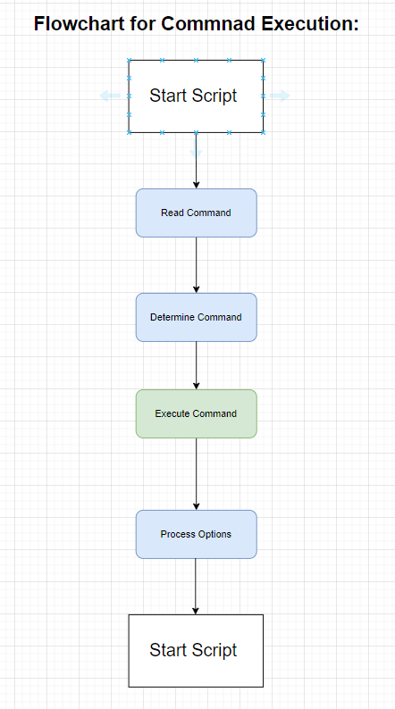

```markdown
# Internsctl Documentation

Internsctl is a custom Linux command-line tool designed for various system operations. It provides commands to fetch CPU information, memory information, manage users, and get file details.

## Usage

```bash
internsctl [COMMAND] [OPTIONS]
```

## Commands

- `cpu getinfo`: Get CPU information.
- `memory getinfo`: Get memory information.
- `user create`: Create a new user.
- `user list`: List all regular users.
- `file getinfo`: Get information about a file.

## Options

- `--sudo-only`: List users with sudo permissions.
- `--help`: Show help message and exit.
- `--version`: Show version information.

## Examples

### Get CPU Information

```bash
internsctl cpu getinfo
```

### Get Memory Information

```bash
internsctl memory getinfo
```

### Create a New User

```bash
internsctl user create [USERNAME]
```

### List Regular Users

```bash
internsctl user list
```

### List Users with Sudo Permissions

```bash
internsctl user list --sudo-only
```

### Get File Information

```bash
internsctl file getinfo [FILENAME] [OPTIONS]
```

### Show Help

```bash
internsctl --help
```

### Show Version Information

```bash
internsctl --version
```
```

This markdown documentation explains the usage, commands, options, and provides examples for utilizing the `internsctl` tool effectively.

```


- It starts by checking for options.
- If options are present, it proceeds accordingly (show help, show - version).
- If no options, it checks for commands.
- If a command is found, it verifies the command arguments.
- If the arguments are valid, it executes the corresponding function.
- Finally, it exits.

```markdown
# INTERNSTCL(1) - February 2024

## NAME
internsctl - Custom Linux command for operations

## SYNOPSIS
**internsctl** [**COMMAND**] [**OPTIONS**]

## DESCRIPTION
**internsctl** is a custom Linux command for various operations. It provides commands to get CPU information, memory information, create users, list users, and get information about files.

## COMMANDS
- **cpu getinfo**: Get CPU information.
- **memory getinfo**: Get memory information.
- **user create**: Create a new user.
- **user list** [**--sudo-only**]: List all regular users or users with sudo permissions.
- **file getinfo** [*--size* | *-s* | *--permissions* | *-p* | *--owner* | *-o* | *--last-modified* | *-m*] *FILE*: Get information about a file. Optionally, display only specific information using options.

## OPTIONS
- **--sudo-only**: List users with sudo permissions.
- **--help**: Show this help message and exit.
- **--version**: Show version information.

## FILE GETINFO OPTIONS
- **--size, -s**: Print file size.
- **--permissions, -p**: Print file permissions.
- **--owner, -o**: Print file owner.
- **--last-modified, -m**: Print last modified time.

## EXAMPLES
- Obtain the size of the specified file only:
```bash
$ internsctl file getinfo --size hello.txt
5448
```
- Obtain the permissions of the specified file only:
```bash
$ internsctl file getinfo --permissions hello.txt
-rw-r--r--
```
- Obtain the owner of the specified file only:
```bash
$ internsctl file getinfo --owner hello.txt
xenonstack
```
- Obtain the last modified time of the specified file only:
```bash
$ internsctl file getinfo --last-modified hello.txt
2020-10-07 20:34:44.616123431 +0530
```

## AUTHOR
Written by Shivam.

## VERSION
internsctl v0.1.0 (February 2024)
```

This markdown represents the manual page for the `internsctl` command, providing detailed documentation including its usage, options, commands, examples, authorship, licensing, and more.